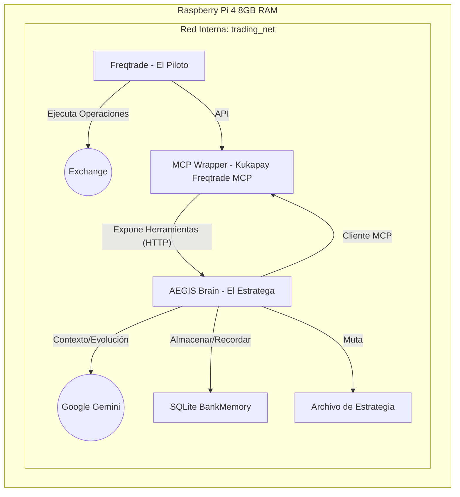

# Proyecto AEGIS: Sistema Híbrido de Trading Algorítmico (v2.2)

> **[Read in English](README_EN.md)**

**Proyecto AEGIS** es un sistema de trading de bajos recursos y alta autonomía diseñado para la Raspberry Pi 4. Implementa una arquitectura "Piloto vs. Estratega" donde un bot de trading determinista (El Piloto) es guiado por un gestor de riesgos impulsado por LLM (El Estratega), y ahora cuenta con un motor de estrategia auto-evolutivo ("Operación EVO").

## 1. Resumen de la Arquitectura

El sistema consta de tres contenedores Docker que se ejecutan en una red interna, utilizando el **Kukapay Freqtrade MCP** como puente.



### Componentes
1.  **El Piloto (Freqtrade):** Ejecuta la estrategia `BBRSI_Optimized`. Maneja la ejecución minuto a minuto de las operaciones.
2.  **El Puente (MCP Wrapper):** Una aplicación FastAPI en contenedor que actúa como un Servidor MCP. Envuelve [kukapay/freqtrade-mcp](https://github.com/kukapay/freqtrade-mcp) y expone la API de Freqtrade como herramientas del Protocolo de Contexto de Modelo (MCP) a través de HTTP.
3.  **El Estratega (AEGIS Brain):** Una aplicación Python que actúa como un **Cliente MCP**. Periódicamente obtiene el contexto del mercado a través del Puente, consulta a Google Gemini para una evaluación de riesgos y almacena las decisiones en una base de datos SQLite local.
4.  **Operación EVO (Motor de Evolución):** Un módulo dentro del Estratega que analiza, muta y mejora autónomamente la estrategia de trading.

### Nueva Característica: Operación EVO (Estrategia Auto-Evolutiva)
El sistema ahora incluye un ciclo de evolución autónomo que se ejecuta semanalmente:
1.  **Analizar:** Consulta la base de datos de Freqtrade para identificar debilidades de rendimiento (por ejemplo, baja tasa de victorias, alta reducción).
2.  **Mutar:** Utiliza Google Gemini para generar un *nuevo* código de estrategia candidata (`BBRSI_Candidate.py`) diseñado para corregir las debilidades identificadas.
3.  **Backtest:** Utiliza el SDK de Docker para activar un backtest de la estrategia candidata dentro del contenedor de Freqtrade.
4.  **Desplegar:** (Modo de Seguridad) Compara el rendimiento de la candidata con la estrategia actual. *Actualmente en modo de seguridad: registra los resultados pero no realiza el cambio automático.*

### Característica: Refuerzo de Memoria de Bucle Cerrado
El Estratega posee una "BankMemory" que le permite aprender de decisiones pasadas:
-   **Instantáneas del Mercado:** Antes de cada decisión, se guardan el contexto y el razonamiento de la IA.
-   **Conciliación:** El sistema verifica periódicamente las operaciones cerradas y las vincula con la predicción original.
-   **RAG (Generación Aumentada por Recuperación):** Al tomar una nueva decisión, el Cerebro recupera escenarios pasados similares y ve si su consejo anterior condujo a una Ganancia o Pérdida.

## 2. Configuración de Hardware (Raspberry Pi 4)

### Requisitos Previos
- Raspberry Pi 4 (se recomiendan 4GB u 8GB)
- SSD conectado vía USB 3.0 (no se recomiendan tarjetas MicroSD para operaciones de base de datos)
- Raspberry Pi OS (64-bit)

### Pasos de Optimización
1.  **Habilitar ZRAM:** Para optimizar el uso de memoria en la Pi.
    ```bash
    sudo apt install zram-tools
    echo "PERCENT=50" | sudo tee -a /etc/default/zramswap
    sudo service zramswap reload
    ```
2.  **Instalar Docker y Docker Compose:**
    ```bash
    curl -fsSL https://get.docker.com -o get-docker.sh
    sudo sh get-docker.sh
    sudo usermod -aG docker $USER
    sudo apt install -y docker-compose-plugin
    ```

## 3. Despliegue

### Opción A: Configuración Automatizada (Recomendada para Pi)
Proporcionamos un script para automatizar la instalación de Docker, ZRAM y la configuración de directorios.

1.  **Clonar y Configurar:**
    ```bash
    git clone <repo_url> project_aegis
    cd project_aegis
    chmod +x scripts/setup_pi.sh
    sudo ./scripts/setup_pi.sh
    ```
    *Reinicia tu Pi después de la configuración.*

2.  **Configuración:**
    - Copia `.env.example` a `.env` y completa tus claves API.
    - Revisa `aegis_brain/config.yaml` para ajustar los umbrales de trading y los pesos.

3.  **Lanzamiento:**
    ```bash
    docker compose up -d
    ```

4.  **Actualizaciones:**
    Para obtener el código más reciente y reiniciar:
    ```bash
    chmod +x scripts/update.sh
    ./scripts/update.sh
    ```

### Opción B: Configuración Manual
Sigue la sección "Requisitos Previos" anterior, luego ejecuta `docker compose up -d`.

## 4. Pruebas y Verificación

Para verificar la lógica del sistema (pruebas unitarias):
```bash
# Instalar dependencias
pip install -r aegis_brain/requirements.txt

# Ejecutar pruebas
python3 -m unittest discover aegis_brain/tests
```

## 5. Estructura del Proyecto

```
project_aegis/
├── aegis_brain/          # El Estratega (Cliente MCP + Lógica LLM)
│   ├── brain.py          # Bucle lógico principal
│   ├── config.yaml       # Configuración (Umbrales, Horario)
│   ├── memory_manager.py # Gestor de Base de Datos SQLite
│   ├── strategy_evolver.py # Operación EVO (Motor de Evolución)
│   ├── tests/            # Pruebas Unitarias
│   ├── Dockerfile        # Definición del contenedor
│   └── requirements.txt  # Dependencias de Python
├── freqtrade/            # El Piloto (Bot de Trading)
│   └── user_data/
│       └── strategies/
│           └── BBRSI_Optimized.py # Estrategia Personalizada
├── mcp_wrapper/          # El Puente (Integración Kukapay)
│   ├── main.py           # Servidor MCP FastAPI
│   └── Dockerfile        # Clona y construye kukapay/freqtrade-mcp
├── scripts/              # Scripts de mantenimiento
│   ├── setup_pi.sh       # Script de configuración automatizada
│   └── update.sh         # Script de actualización
├── docker-compose.yml    # Orquestación
├── .env.example          # Plantilla de configuración
└── .gitignore            # Configuración de Git
```

## 6. Notas de Seguridad
-   **Red:** Todos los contenedores se comunican a través de una red puente interna (`trading_net`). Solo los puertos 8080 (UI de Freqtrade) y 8000 (Servidor MCP) están expuestos al host.
-   **Logs:** El registro de Docker está limitado a 10MB por contenedor para prevenir el desgaste del SSD.
-   **Secretos:** Nunca confirmes `.env` o `user_data/config.json` en el control de versiones.

---
*Generado por Antigravity para Proyecto AEGIS*
