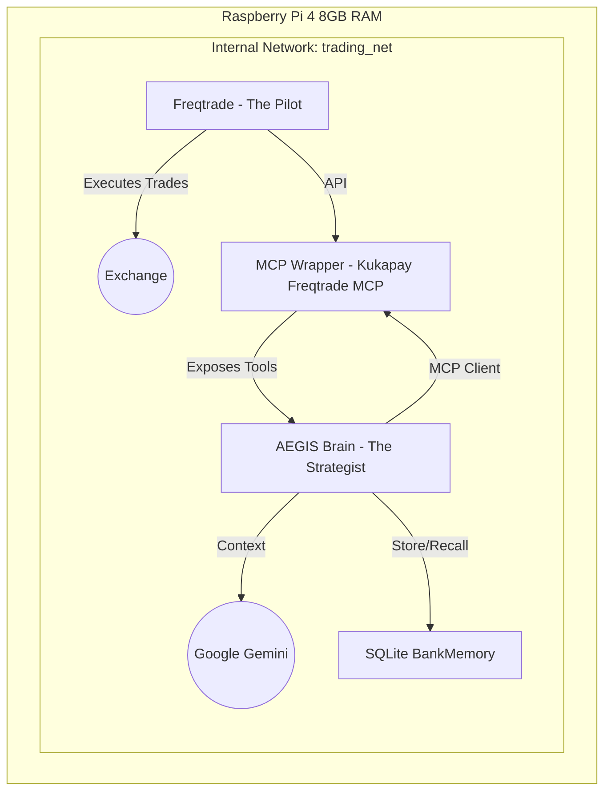

# Project AEGIS: Hybrid Algorithmic Trading System (v2.1)

**Project AEGIS** is a low-resource, high-autonomy trading system designed for the Raspberry Pi 4. It implements a "Pilot vs. Strategist" architecture where a deterministic trading bot (The Pilot) is guided by an LLM-powered risk manager (The Strategist).

## 1. Architecture Overview

The system consists of three Docker containers running on an internal network, utilizing the **Kukapay Freqtrade MCP** as the bridge.



### Components
1.  **The Pilot (Freqtrade):** Runs the `BBRSI_Optimized` strategy. It handles the minute-by-minute execution of trades.
2.  **The Bridge (MCP Wrapper):** A containerized version of [kukapay/freqtrade-mcp](https://github.com/kukapay/freqtrade-mcp). It exposes Freqtrade's API as Model Context Protocol (MCP) tools.
3.  **The Strategist (AEGIS Brain):** A Python application acting as an **MCP Client**. It periodically fetches market context via the Bridge, consults Google Gemini for a risk assessment, and stores decisions in a local SQLite database.

### New Feature: Closed-Loop Memory Reinforcement
The Strategist now possesses a "BankMemory" that allows it to learn from past decisions:
-   **Market Snapshots:** Before every decision, the context and the AI's reasoning are saved.
-   **Reconciliation:** The system periodically checks for closed trades and links them back to the original prediction.
-   **RAG (Retrieval-Augmented Generation):** When making a new decision, the Brain retrieves similar past scenarios (e.g., "RSI_HIGH" conditions) and sees whether its past advice led to a Profit or Loss.

## 2. Hardware Setup (Raspberry Pi 4)

### Prerequisites
- Raspberry Pi 4 (4GB or 8GB recommended)
- SSD connected via USB 3.0 (MicroSD cards are not recommended for DB operations)
- Raspberry Pi OS (64-bit)

### Optimization Steps
1.  **Enable ZRAM:** To optimize memory usage on the Pi.
    ```bash
    sudo apt install zram-tools
    echo "PERCENT=50" | sudo tee -a /etc/default/zramswap
    sudo service zramswap reload
    ```
2.  **Install Docker & Docker Compose:**
    ```bash
    curl -fsSL https://get.docker.com -o get-docker.sh
    sudo sh get-docker.sh
    sudo usermod -aG docker $USER
    sudo apt install -y docker-compose-plugin
    ```

## 3. Deployment

### Option A: Automated Setup (Recommended for Pi)
We provide a script to automate the installation of Docker, ZRAM, and directory setup.

1.  **Clone and Setup:**
    ```bash
    git clone <repo_url> project_aegis
    cd project_aegis
    chmod +x scripts/setup_pi.sh
    sudo ./scripts/setup_pi.sh
    ```
    *Reboot your Pi after setup.*

2.  **Configuration:**
    - Copy `.env.example` to `.env` and fill in your API keys.
    - Review `aegis_brain/config.yaml` to tune trading thresholds and weights.

3.  **Launch:**
    ```bash
    docker compose up -d
    ```

4.  **Updates:**
    To pull the latest code and restart:
    ```bash
    chmod +x scripts/update.sh
    ./scripts/update.sh
    ```

### Option B: Manual Setup
Follow the "Prerequisites" section above, then run `docker compose up -d`.

## 4. Testing & Verification

To verify the system logic (unit tests):
```bash
# Install dependencies
pip install -r aegis_brain/requirements.txt

# Run tests
python3 -m unittest discover aegis_brain/tests
```

## 5. Project Structure

```
project_aegis/
├── aegis_brain/          # The Strategist (MCP Client + LLM Logic)
│   ├── brain.py          # Main logic loop
│   ├── config.yaml       # Configuration (Thresholds, Schedule)
│   ├── memory_manager.py # SQLite Database Manager
│   ├── strategy_evolver.py # Evolution Engine
│   ├── tests/            # Unit Tests
│   ├── Dockerfile        # Container definition
│   └── requirements.txt  # Python dependencies
├── freqtrade/            # The Pilot (Trading Bot)
│   └── user_data/
│       └── strategies/
│           └── BBRSI_Optimized.py # Custom Strategy
├── mcp_wrapper/          # The Bridge (Kukapay Integration)
│   └── Dockerfile        # Clones and builds kukapay/freqtrade-mcp
├── scripts/              # Maintenance scripts
│   ├── setup_pi.sh       # Automated setup script
│   └── update.sh         # Update script
├── docker-compose.yml    # Orchestration
├── .env.example          # Config template
└── .gitignore            # Git configuration
```

## 6. Security Notes
- **Network:** All containers communicate via an internal bridge network (`trading_net`). Only ports 8080 (Freqtrade UI) and 8000 (MCP Server) are exposed to the host.
- **Logs:** Docker logging is limited to 10MB per container to prevent SSD wear.
- **Secrets:** Never commit `.env` or `user_data/config.json` to version control.

---
*Generated by Antigravity for Project AEGIS*
